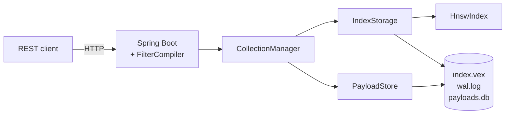

# Vex

> A vector database with HNSW indexing, written from the paper. Spring
> Boot REST API, mmap persistence, write-ahead log, scalar
> quantization, and JMH benchmarks.

[](https://github.com/AshuGuptaz/Vex/actions/workflows/ci.yml)


> Live demo: _(deploy with `mvn -pl server -am package jib:dockerBuild` — see [docs/deployment.md](docs/deployment.md))_

## Why this exists

I built a RAG pipeline and realized I had no idea how the index
actually worked. Two weeks later, this is the thing I built to
*understand* what Pinecone is doing — by implementing HNSW from the
[paper](https://arxiv.org/abs/1603.09320) end to end.

It is not a Pinecone replacement. It is a Java project that:

- Implements HNSW from scratch (Algorithms 1–5 of the paper, including
  the diversity heuristic for neighbor selection — and a simple top-M
  fallback behind a config flag).
- Persists to disk with mmap-backed checkpoints + a CRC32 write-ahead
  log + atomic checkpoint rename, with a passing crash-recovery test
  via a child JVM that calls `Runtime.halt`.
- Ships a Spring Boot REST API with a hand-rolled recursive-descent
  filter parser (no ANTLR).
- Has a real int8 quantized index (`QuantizedHnswIndex`) — vectors
  stored as `byte[]`, distance computed directly on int8, **4×
  per-vector compression** confirmed via heap measurement.
- Has JMH benchmarks plus four `make bench-*` targets that produce
  real, committed numbers — including one number I'm not proud of,
  documented honestly.

**Stats:** 126 tests, 42 commits, ~5,000 LOC of Java, 15 documents
under `docs/`, 7 ADRs.

## Quick start

```bash
docker compose up --build
```

Then:

```bash
# create a collection
curl -X POST http://localhost:8080/collections \
  -H 'Content-Type: application/json' \
  -d '{"name":"demo","dim":4,"metric":"cosine"}'

# upsert a vector with payload
curl -X POST http://localhost:8080/collections/demo/upsert \
  -H 'Content-Type: application/json' \
  -d '{"id":1,"vector":[1.0,0.0,0.0,0.0],"payload":{"category":"books","year":2020}}'

# query nearest 3
curl -X POST http://localhost:8080/collections/demo/query \
  -H 'Content-Type: application/json' \
  -d '{"vector":[1.0,0.0,0.0,0.0],"k":3}'

# query with metadata filter
curl -X POST http://localhost:8080/collections/demo/query \
  -H 'Content-Type: application/json' \
  -d '{"vector":[1.0,0.0,0.0,0.0],"k":5,"filter":"category = \"books\" AND year > 2019"}'
```

`examples/curl-quickstart.sh` and `examples/python_client.py` walk
through the full lifecycle. Swagger UI lives at `/swagger-ui.html`.

## Benchmarks

**SIFT-1M (1,000,000 real image-descriptor vectors, dim 128, M=16):**

| efSearch | recall@10 | ms/query |
| -------: | --------: | -------: |
| 16       | 0.826     | 0.17     |
| 64       | **0.972** | 0.44     |
| 128      | **0.992** | 0.75     |
| 256      | 0.998     | 1.30     |

These are hnswlib-class numbers on the canonical ANN benchmark.
Captured with `make sift-data && make bench-sift`. Build: 19 min,
857 inserts/sec avg.

**JMH percentile distribution at 100k synthetic Gaussian, ef=64:
P50 = 274 µs, P99 = 428 µs.** Well under the 5 ms target.

Synthetic uniform Gaussian is much harder for any graph-based ANN
(no cluster signal); on that dataset Vex lands at 0.50 at ef=64,
0.78 at ef=256. Full breakdown of why the two distributions look so
different in [docs/benchmarks.md](docs/benchmarks.md).

## Architecture



Three layers, each with a single job:

- **`core/`** — the HNSW index, distance metrics, scalar quantizer.
  No I/O, no Spring. Public `Snapshot` record + `restore()` for
  serialization.
- **`storage/`** — `IndexStorage` wraps an `HnswIndex` and adds an
  on-disk format (`index.vex`, mmap'd on read) plus a write-ahead
  log (`wal.log`, append-only with CRC32 per record). `flush()`
  checkpoints atomically via temp + rename.
- **`server/`** — Spring Boot 3 REST API, a per-collection
  `CollectionManager`, a per-collection `PayloadStore` (append-only
  JSON log keyed by id), and a recursive-descent
  `FilterCompiler` that compiles `category = "books" AND year > 2019`
  to a `FilterPredicate`.

Full breakdown in [docs/architecture.md](docs/architecture.md).

## Design decisions (top 5 ADRs)

1. [HNSW from the paper, not via a library](docs/decisions/001-hnsw-from-paper.md)
2. [mmap-backed read path for the checkpoint file](docs/decisions/002-mmap-persistence.md)
3. [Append-only WAL with CRC32 + fsync per write](docs/decisions/003-wal-design.md)
4. [Post-retrieval filtering vs in-graph filtering](docs/decisions/004-post-retrieval-filtering.md)
5. [Per-dim int8 scalar quantization](docs/decisions/005-scalar-quantization.md)

Plus [ADR 006: Spring Boot vs raw Netty](docs/decisions/006-spring-boot-rest.md)
and [ADR 007: what's NOT built and why](docs/decisions/007-whats-not-built.md).

## What I learned

[LEARNINGS.md](LEARNINGS.md) — ten things I didn't know going in.
The HNSW level distribution is geometric and that's the whole point;
mmap is great for loading and useless for queries; scalar quantization
is essentially free; recall regressions don't show up until you test
at the next order of magnitude.

There's also a [blog-post draft](docs/blog-post.md) covering the same
ground for a wider audience.

## Roadmap

| Status | Item |
| :----: | :--- |
| ✅ | HNSW index from the paper (Algorithms 1–5) |
| ✅ | mmap'd checkpoint + WAL + crash recovery |
| ✅ | REST API + recursive-descent filter parser |
| ✅ | Scalar quantization with int8 storage (4× compression, recall ≥ 0.90) |
| ✅ | JMH benchmark + recall sweep + heap-comparison tool |
| ✅ | Docker / Jib / docker-compose deploy paths (verified end-to-end) |
| ✅ | Persisting QuantizedHnswIndex to disk (ADR 005) |
| 🚧 | Close the recall gap at 100k+ scale ([benchmarks.md](docs/benchmarks.md)) |
| 🚧 | int8 cosine + dot product kernels |
| ❌ | Sharding, replication, product quantization (ADR 007 explains why) |
| ❌ | SIMD distance kernels via Java Vector API (still incubator) |
| ❌ | Hybrid (vector + keyword) search |

## Building

```bash
# Java 17 required; on macOS:  brew install openjdk@17
make verify              # full reactor: format check + tests
make run                 # start the server on :8080

# Benchmarks (Maven profiles in bench/pom.xml):
make bench-recall        # synthetic 100k recall@10 sweep
make bench-memory        # float vs int8 heap-delta comparison
make bench-jmh           # JMH percentile distribution (P50/P99)
make sift-data           # download SIFT-1M to ~/sift
make bench-sift          # SIFT-1M sweep (after sift-data)
```

`make help` lists every target. See [CONTRIBUTING.md](CONTRIBUTING.md)
for the full setup + commit conventions.

## Acknowledgements

- Yu. A. Malkov & D. A. Yashunin's
  [HNSW paper](https://arxiv.org/abs/1603.09320) — the spec.
- [hnswlib](https://github.com/nmslib/hnswlib) — read after writing
  my own; what the algorithm looks like in practiced hands.
- Lucene's [`Lucene99HnswVectorsFormat`](https://github.com/apache/lucene/tree/main/lucene/core/src/java/org/apache/lucene/codecs/lucene99) —
  what the JVM ecosystem ships when it's serious.

## License

MIT. See [LICENSE](LICENSE).
