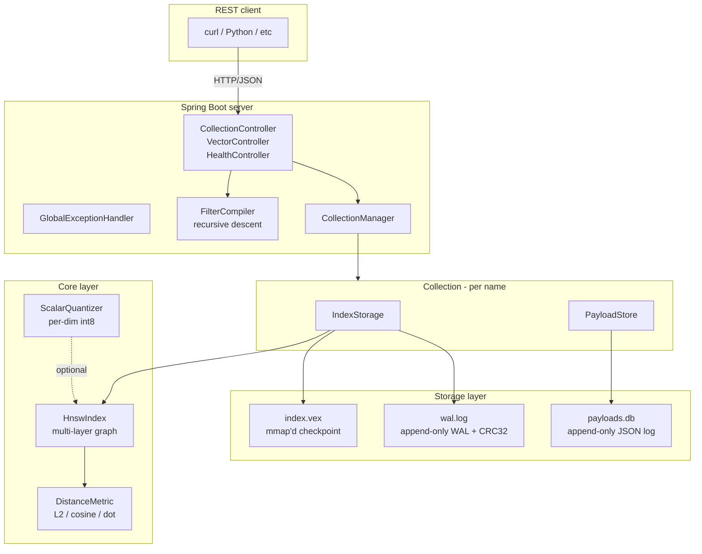

# Vex architecture



## Three layers, each with one job

### Core (`core/`) — the index itself

`HnswIndex` is a hand-rolled implementation of Algorithms 1-5 from
Malkov & Yashunin (2016). The graph is `int[][][]` indexed by
`[node][layer][neighbor]`. Vectors are `float[][]` indexed by
`[node][dim]`. A `ReentrantReadWriteLock` makes inserts single-writer
and queries multi-reader.

`DistanceMetric` is the dispatch point for L2 (squared), cosine, and
dot product, all unified to "smaller is closer" so HNSW's ordering
logic stays metric-agnostic.

`ScalarQuantizer` handles per-dimension int8 encoding and decoding
plus a direct int8-domain L2 distance. Trained on a sample, frozen
afterwards.

The core has no I/O, no Spring, no logging beyond SLF4J. Everything
above it depends on it; it depends on nothing.

### Storage (`storage/`) — durability

`IndexStorage` wraps a `HnswIndex` and adds:

- **Write-ahead log** (`wal.log`) — append-only with a CRC32 per record.
  Every insert/delete writes the WAL before updating the in-memory
  index. fsync per-write is the default. Replay on open ignores
  truncated or CRC-mismatched tails.
- **Checkpoint** (`index.vex`) — full snapshot of vectors + graph in
  a fixed binary format (see `docs/storage-format.md`). Read via
  `FileChannel.map()`; written via `FileChannel.write()` then atomic
  rename.

`flush()` writes a fresh checkpoint and truncates the WAL. `close()`
flushes then closes everything.

### Server (`server/`) — REST + filtering

Spring Boot 3 exposes the collections + vectors API. Two controllers
(`CollectionController`, `VectorController`) handle the REST surface;
a third handles `/health`. `GlobalExceptionHandler` maps domain
exceptions to HTTP status codes.

`FilterCompiler` is a hand-rolled lexer + recursive-descent parser for
the filter expression grammar (`a = "x" AND year > 2020`). It compiles
to a `FilterPredicate` that runs against the result payload after
HNSW retrieval. ADR 004 explains why post-retrieval beats pre-filtering
for v1.

`CollectionManager` is the in-memory registry of collections. Each
collection has its own data directory, its own `IndexStorage`, and its
own `PayloadStore`.

`PayloadStore` is a tiny append-only JSON log keyed by vector id —
last-write-wins on reopen.

## Data flow (a single insert)

```
client → POST /collections/{name}/upsert
       → VectorController.upsert
       → CollectionManager.require → Collection
       → Collection.upsert
              ├─ IndexStorage.add
              │      ├─ WriteAheadLog.appendInsert (fsync if configured)
              │      └─ HnswIndex.add (write-locked)
              └─ PayloadStore.put (fsync if configured)
       ← 202 Accepted
```

## Data flow (a single query)

```
client → POST /collections/{name}/query  body: {vector, k, filter?}
       → VectorController.query
       → CollectionManager.require → Collection
       → Collection.query
              ├─ FilterCompiler.compile  (if filter)
              ├─ IndexStorage.query → HnswIndex.query (read-locked)
              │   ├─ greedy descent through upper layers
              │   └─ ef-bounded best-first search at layer 0
              └─ PayloadStore.get  (per result, attach payload, apply filter)
       ← 200 [{id, distance, payload}, ...]
```

## What lives where (one-liner per file group)

| Path                                                 | Purpose                                           |
| ---------------------------------------------------- | ------------------------------------------------- |
| `core/.../HnswIndex.java`                            | the index, paper Algorithms 1-5                   |
| `core/.../DistanceMetric.java` + impls               | distance functions, "smaller-is-closer"           |
| `core/.../ScalarQuantizer.java`                      | per-dim int8 quantization                          |
| `storage/.../IndexFile.java`                         | binary format: magic + header + vector + graph   |
| `storage/.../WriteAheadLog.java`                     | length-prefixed records, CRC32                    |
| `storage/.../IndexStorage.java`                      | facade combining HnswIndex + IndexFile + WAL     |
| `server/.../filter/FilterCompiler.java`              | lex + parse + compile to FilterPredicate          |
| `server/.../domain/Collection.java`                  | per-collection state + upsert / query / delete    |
| `server/.../domain/CollectionManager.java`           | lifecycle and lookup                              |
| `server/.../api/CollectionController.java`           | REST surface for collection CRUD                  |
| `server/.../api/VectorController.java`               | REST surface for vector CRUD + query              |
| `bench/.../QueryLatencyBenchmark.java`               | JMH percentile distribution                       |
| `bench/.../RecallSweep.java`                         | recall@10 sweep over efSearch                     |
